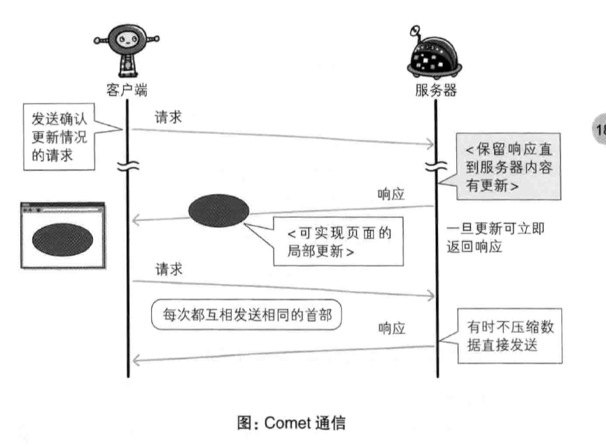
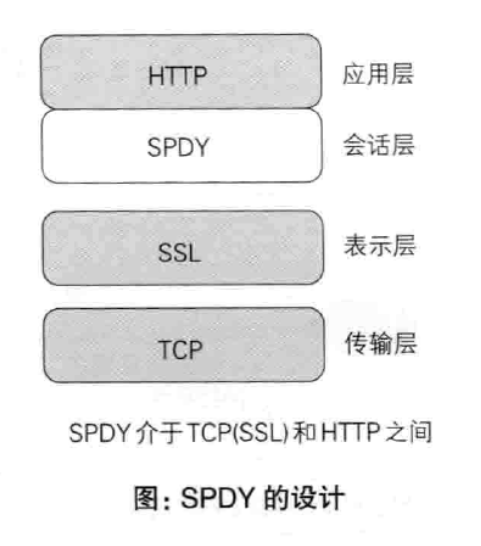

# 基于HTTP的追加协议

## HTTP的瓶颈

## 解决方案

### Ajax技术

+ 原理： 异步加载数据，使得页面可以局部更新，响应中传输的数据量小了，性能自然得到提高
+ 缺陷： 可能会导致大量请求产生，且并未解决HTTP本身存在的问题

### Comet技术

- 原理：通过服务器的长链接来产生延迟响应，实现了服务器的推送
- 缺陷： 维持长链接会消耗更多资源，且并未解决HTTP本身存在的问题

### SPDY协议

+ 原理：在SSL层上增加一个SPDY会话层，以在一个TCP连接中实现并发流。SSL层上增加SPDY会话层通常的HTTP GET和POST格式仍然是一样的；然而SPDY为编码和传输数据设计了一个新的帧格式。流是双向的，可以在客户端和服务器端启动。SPDY旨在通过基本（始终启用）和高级（可选启用）功能实现更低的延迟。
+ 功能：
  1. 多路复用：在一条TCP连接中并发多个请求，防止请求的阻塞
  2. 赋予请求优先级
  3. 压缩HTTP首部
  4. 服务器推送功能：赋予服务器主动向客户端推送数据的功能
  5. 服务器提示功能：服务器可以主动提示客户端需要请求的资源
+ 现状：已被 HTTP/2 取代

### WebSocket协议

+ 原理：属于HTML5中的协议，和HTTP协议有交集，Websocket是基于HTTP协议的，或者说**借用**了HTTP的协议来完成一部分握手 *(发送Upgrade字段进行通信协议的改变)*，建立协议后客户端和服务器任何一端都可以直接向对方发送报文
+ 功能：
  1. 服务器推送功能
  2. 持久连接：只要建立起 WebSocket 连接，就希望一直保持连接状态

###  HTTP/2 （待更新）

+ 原理：

