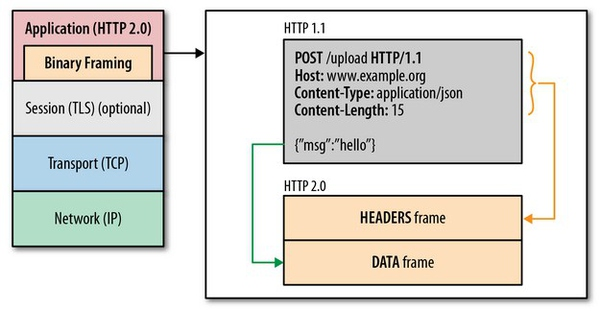
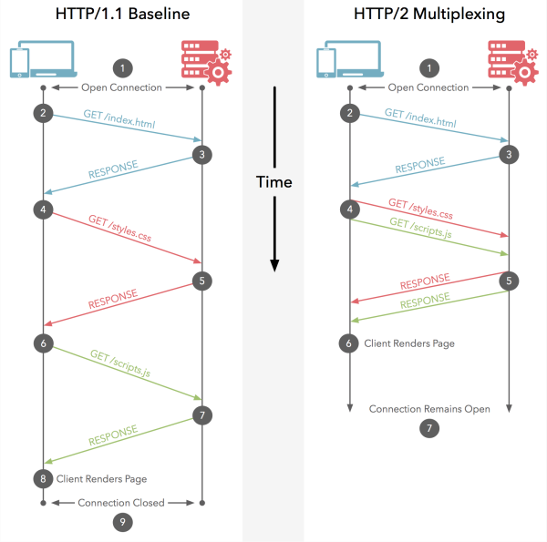

# HTTP/2

## HTTP现状

+ 过于庞大：细节过多
+ 过多的可选项
+ 未能充分利用 TCP
+ HTTP 1.1 对网络延迟过为敏感
+ 网站对资源的需求量和大小逐年增加
+ 线头阻塞（Head of line blocking）

> HTTP Pipelining (管线化) 把多个HTTP请求放到一个TCP连接中一一发送，而在发送过程中不需要等待服务器对前一个请求的响应；只不过，客户端还是要按照发送请求的顺序来接收响应。如果前一个请求非常耗时，那么后续请求都会受到影响。这就是 **线头阻塞（Head of line blocking）** 。虽然请求可以通过新建一个 TCP 连接来快速得到响应，但是这样的开销过大，靠大量新建连接是不能有效解决延迟问题的，即 HTTP Pipelining 并不能彻底解决 Head of line blocking 问题。
>
> *大部分桌面浏览器会选择默认关闭HTTP pipelining*

## HTTP/2 的特点

### 二进制协议

HTTP/2 基于二进制，这个特性使得 HTTP/2 比起基于文本的 HTTP/1.1 对于帧的识别更加快速和简单，同时 HTTP/2 使得我们可以更加便捷的从帧结构中分离出那部分协议本身的内容

### 二进制分帧

由于 HTTP/1.1 的普及程度， HTTP/2 不可能完全重新定义新的规则，所以在不改动 HTTP/1.x 的语义、方法、状态码、URI 以及首部字段等等的情况下，HTTP/2 在 应用层(HTTP/2) 和 传输层(TCP or UDP) 之间增加一个二进制分帧层，在二进制分帧层中, HTTP/2 会将所有传输的信息分割为更小的消息和帧(frame), 并对它们采用二进制格式的编码 ,其中 HTTP1.x 的首部信息会被封装到 HEADER frame，而相应的 Request Body 则封装到 DATA frame 里面

### 多路复用的流

 

流是一个独立的，双向的帧序列，它可以通过一个http2的连接在服务端与客户端之间不断的交换数据。另外流可以实现多路复用，这意味着在同一连接中来自各个流的数据包会被混合在一起，在到达是重组

### 优先级和依赖性

每个流都会包含一个优先级，借助于PRIORITY帧，客户端同样可以告知服务器当前的流依赖于其他哪个流。该功能让客户端能建立一个优先级“树”，所有“子流”会依赖于“父流”的传输完成情况。另外，优先级和依赖关系可以在传输过程中被动态改变

### 头部压缩

HTTP/1.1请求的大小正变得越来越大，HTTPS和SPDY的压缩机制被发现有受[BREACH](http://en.wikipedia.org/wiki/BREACH_%28security_exploit%29)和[CRIME](http://en.wikipedia.org/wiki/CRIME)攻击的隐患，为此 [HPACK](http://www.rfc-editor.org/rfc/rfc7541.txt)，HTTP/2头部压缩被设计出来了，新的格式同时引入了一些其他对策让破解压缩变得困难，例如采用帧的可选填充和用一个bit作为标记，来让中间人不压缩指定的头部

### 重置帧

在 HTTP/1.1 中，很难中断一个已被发出的 HTTP 消息，虽然可以断开整个 TCP 连接，但是开销过大。

在 HTTP/2 中，可以通过发送 RST_STREAM 帧来终止当前传输的消息并重新发送一个新的，从而避免带宽的浪费

### 服务器推送（缓存推送）

当一个客户端请求资源X，而服务器知道它很可能也需要资源Z的情况下，服务器可以在客户端发送请求前，主动将资源Z推送给客户端。这个功能帮助客户端将Z放进缓存以备将来之需

###  流量控制

每个http2流都拥有自己的公示的流量窗口，它可以限制另一端发送数据

## 参考资料

[http2详解]: https://www.gitbook.com/book/ye11ow/http2-explained
[知乎-HTTP/2.0 相比1.0有哪些重大改进？]: https://www.zhihu.com/question/34074946