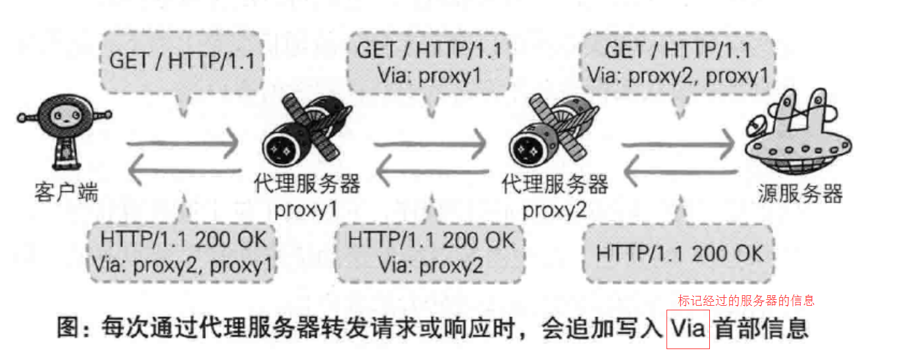
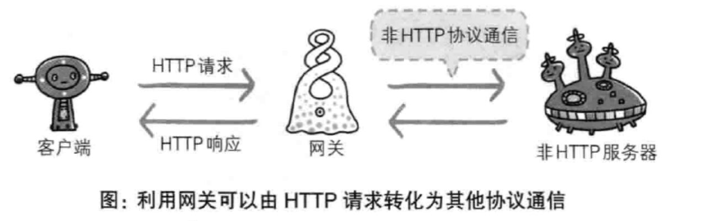
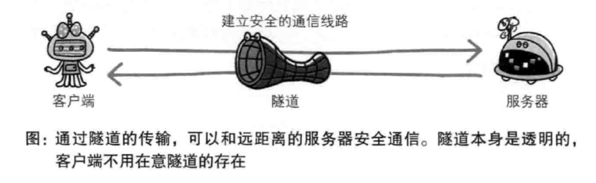

# HTTP简介

## 方法

+ GET：获取资源
+ POST：传输实体主体
+ PUT：传输文件
+ HEAD：获得报文首部
+ DELETE：删除文件
+ OPTIONS：询问支持的方法
+ TRACE：追踪路径
+ CONNECT：要求使用隧道协议连接代理

## 持久连接和管线化

### 持久链接

只要任意一端不提出明确断开连接的请求，就保持 TCP连接，减少了 TCP连接的重复建立与断开而产生的额外开销，减轻了服务器负担

### 管线化

传统的情况下，客户端在发送一个 HTTP 请求后需要得到响应才能发送下一个请求，而管线化（pipelining）使得同时并发发送多个请求成为可能

## 状态码

状态码有非常多，这里只列举常用的几种

### 1XX 信息性状态码

### 2XX 成功状态码

+ 200 OK
+ 204 服务器成功响应，但是没有实体数据
+ 206 部分获取

### 3XX 重定向状态码

+ 301 永久性重定向
+ 302 暂时性重定向
+ 303 对于POST请求，它表示请求已经被处理，客户端可以接着使用GET方法去请求Location里的URI
+ 304 客户端已经执行了GET，但文件未变化（然而和重定向没有关系）
+ 307 对于POST请求，表示请求还没有被处理，客户端应该向Location里的URI重新发起POST请求

> 对于 301 和 302，推荐在任何情况下优先使用 301，因为 302 容易引起**网址劫持**
>
> 从网址A 做一个 302 重定向到网址B 时，主机服务器的隐含意思是网址A 随时有可能改主意，重新显示本身的内容或转向其他的地方。大部分的搜索引擎在大部分情况下，当收到 302 重定向时，一般只要去抓取目标网址就可以了，也就是说网址 B。如果搜索引擎在遇到 302 转向时，百分之百的都抓取目标网址 B 的话，就不用担心网址 URL 劫持了。问题就在于，有的时候搜索引擎，尤其是 Google，并不能总是抓取目标网址。比如说，有的时候A 网址很短，但是它做了一个302 重定向到B 网址，而 B 网址是一个很长的乱七八糟的URL 网址，甚至还有可能包含一些问号之类的参数。很自然的，A 网址更加用户友好，而 B 网址既难看，又不用户友好。这时 Google 很有可能会仍然显示网址A。由于搜索引擎排名算法只是程序而不是人，在遇到 302 重定向的时候，并不能像人一样的去准确判定哪一个网址更适当，这就造成了网址 URL 劫持的可能性。也就是说，一个不道德的人在他自己的网址A 做一个 302 重定向到你的网址B，出于某种原因， Google 搜索结果所显示的仍然是网址A，但是所用的网页内容却是你的网址B 上的内容，这种情况就叫做网址URL 劫持。你辛辛苦苦所写的内容就这样被别人偷走了。302 重定向所造成的网址URL 劫持现象，已经存在一段时间了。不过到目前为止，似乎也没有什么更好的解决方法。在正在进行的谷歌大爸爸数据中心转换中，302 重定向问题也是要被解决的目标之一。从一些搜索结果来看，网址劫持现象有所改善，但是并没有完全解决。
>
> 301跳转对查找引擎是一种对照驯良的跳转编制，也是查找引擎能够遭遇的跳转编制，它告诉查找引擎，这个地址弃用了，永远转向一个新地址，可以转移新域名的权重。而302重定向很容易被搜索引擎误认为是利用多个域名指向同一网站，那么你的网站就会被封掉，罪名是“利用重复的内容来干扰Google搜索结果的网站排名”。

### 4XX 客户端错误状态码

+ 400 Bad Request 请求报文中可能有语法错误
+ 401 认证失败
+ 403 服务器拒绝访问该资源
+ 404 服务器上未找到该资源

### 5XX 服务器错误状态码

+ 500 服务器内部资源故障
+ 503 服务器忙

## 通信数据转发程序

### 代理

#### 分类基准

+ 使用缓存 => 缓存代理
+ 不修改报文 => 透明代理

### 网关

与代理十分类似，不同的地方在于网关能使通信线路上的服务器提供非 HTTP 服务

### 隧道

> 如果我们想在复用现有的HTTP proxy的传输方式来代理HTTPS流量，那么就会变成浏览器和代理握手跑TLS，代理拿到明文的请求报文，代理和网站握手跑TLS。但是代理没有，也不可能有网站的私钥证书，所以这么做会导致浏览器和代理之间的TLS无法建立，证书校验根本通不过。HTTP tunnel以及CONNECT报文解决了这个问题，代理服务器不再作为中间人，不再改写浏览器的请求，而是把浏览器和远端服务器之间通信的数据原样透传，这样浏览器就可以直接和远端服务器进行TLS握手并传输加密的数据。

## 参考资料

+ [302转向与网址劫持]: https://www.seozac.com/seo-tips/302-redirect-page-hijacking/

+ [什么是HTTP隧道，怎么理解HTTP隧道呢？]: https://www.zhihu.com/question/21955083	"andwxh的回答"