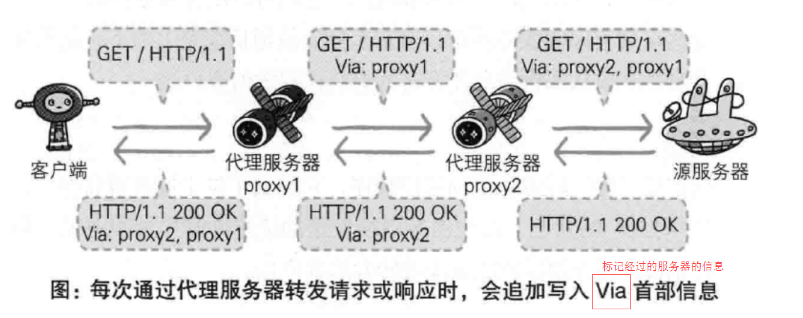
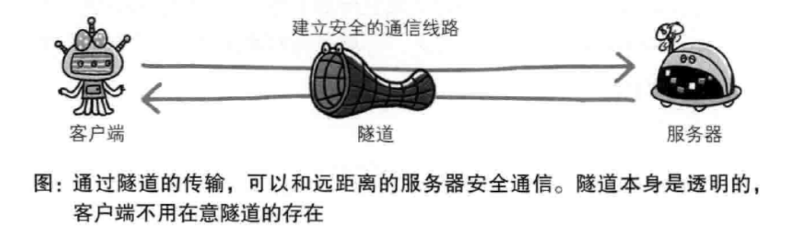

# 通信数据转发程序

## 代理

### 分类基准

- 使用缓存 => 缓存代理
- 不修改报文 => 透明代理

## 网关

与代理十分类似，不同的地方在于网关能使通信线路上的服务器提供非 HTTP 服务

## 隧道

> 如果我们想在复用现有的HTTP proxy的传输方式来代理HTTPS流量，那么就会变成浏览器和代理握手跑TLS，代理拿到明文的请求报文，代理和网站握手跑TLS。但是代理没有，也不可能有网站的私钥证书，所以这么做会导致浏览器和代理之间的TLS无法建立，证书校验根本通不过。HTTP tunnel以及CONNECT报文解决了这个问题，代理服务器不再作为中间人，不再改写浏览器的请求，而是把浏览器和远端服务器之间通信的数据原样透传，这样浏览器就可以直接和远端服务器进行TLS握手并传输加密的数据。

## 参考资料

- [什么是HTTP隧道，怎么理解HTTP隧道呢？](https://www.zhihu.com/question/21955083)