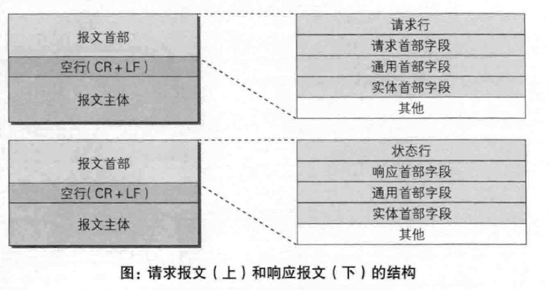

# HTTP报文

## 结构

大体上

---

分类后

## 首部字段

### 通用首部字段

+ Cache-Control 通过传递部分参数控制缓存行为
+ Connection 控制不再转发给代理的首部字段 和 管理持久连接
+ Date 报文创建日期
+ Pragma 历史遗留字段，为了向后兼容而定义
+ Trailer 说明在报文主体后记录的首部字段
+ Transfer-Encoding 规定传输时报文主体的编码方式
+ Upgrade 用于提升更高版本的协议
+ Via 各代理服务器会在 Via 首部添加自身服务器的信息
+ Warning 警告

### 请求首部字段

+ Accept系
  + Accept 通知服务器，客户端可处理的媒体类型与优先级
  + Accept-Charset 客户端支持的字符集与优先级
  + Accept-Encoding 客户端支持的内容编码格式与优先级
  + Accept-Language 客户端可处理的语言与优先级
+ Authorization 告知服务器，客户端的认证信息
+ Expect 告知服务器，客户端期望的行为
+ From 告知服务器，客户端的电子邮件地址
+ Host 告知服务器，请求资源的主机名和端口号（**必须被包含的首部字段**）
+ 条件请求
  + If-Match 当字段值和 ETag 值匹配时才接受请求
  + If-None-Match 与之相反
  + If-Range 当字段值和 ETag 值匹配时进行范围请求
  + If-Modified-Since 字段值之后更新过才接受请求
  + If-Unmodified-Since 与之相反
+ Max-Forwards 当使用 TRACE 或 OPTIONS 时，可指定可通过的服务器的最大数量
+ Proxy-Authorization 代理服务器认证
+ Range 部分请求的字节范围
+ Refer 发起请求的URI
+ User-Agent 将浏览器和用户代理等信息传给服务器
+ TE

### 响应首部字段

+ Accept-Range 告知客户端是否能处理范围请求（byte 表示可以，none 表示不行）
+ Age 告知客户端源服务器在多久前创建了响应
+ ETag 实体标示
+ Location 用于告知客户端重定向URI
+ Proxy-Authorization 告知客户端代理服务器要求的认证信息
+ Retry-After 告知客户端因该多久之后重新发送请求（搭配 503 或 3XX）
+ Server 告知客户端，服务器上的应用程序信息
+ Vary 
+ WWW-Authenticate HTTP认证

### 实体首部字段

+ Allow 说明服务器支持的HTTP方法
+ Content-Encoding 告知客户端，服务器对实体主体的编码方式
+ Content-Language 告知客户端，实体主体的自然语言
+ Content-Length 告知客户端，实体主体的大小
+ Content-Location 告知客户端，报文主体的对应的 URI
+ Content-MD5 告知客户端，实体主体的 MD5 值
+ Content-Range 针对范请求，告知客户端，实体主体的请求的范围 
+ Content-Type 告知实体主体的媒体类型
+ Expires 告知资源的失效日期
+ Last-Modified 指名资源最后修改时间

### Cookie首部

#### Set-Cookie

+ 属性
  + 名称和值 如 NAME = Value **（必须项）**
  + expires 指定 Cookie 有效期，忽略此属性时 Cookie 只存在与维持 Session 的时间段内
  + path 将服务器上的文件目录作为 Cookie 的适用对象
  + domain 作为 Cookkie 适用对象的域名
  + Secure 限制 HTTPS 时才可以发送 Cookie
  + HttpOnly 防止 JavaScript 获取 Cookie

#### Cookie

字段名 = 值

### 其他

+ 请求
  + DNT 拒绝个人信息被追踪，0 同意，1 拒绝
+ 响应
  + X-Frame-Options 控制网站内容在其他页面 Frame 标签内的显示问题，DENY 拒绝，SAMEORIGIN 同源
  + X-XSS-Protection 防护 XSS 攻击，0 关闭，1 开启
  + P3P 将用户隐私变为仅供程序理解的形式从而保护用户隐私
