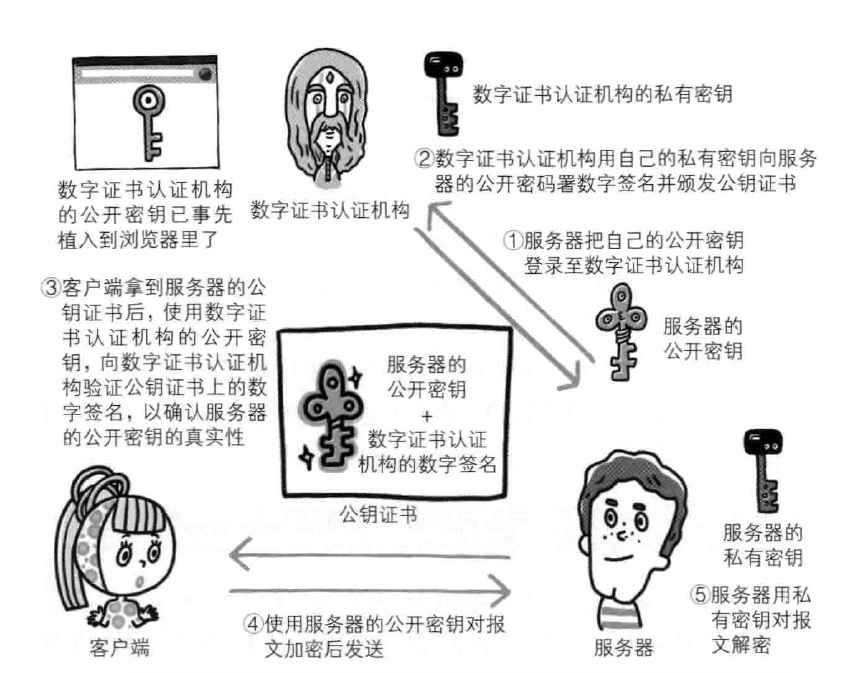
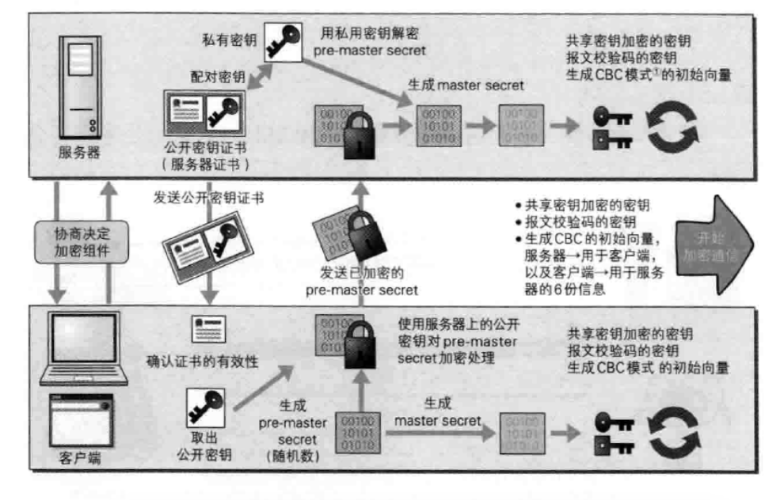

# HTTPS协议

## HTTP 协议的主要不足

+ 通信使用明文，内容可被窃听
+ 不验证通信方身份，可遭遇伪装
+ 无法证明报文完整性，内容可遭篡改

## 基础

### 加密技术

#### 共享(对称)密钥加密

+ 特点：加密和解密都采用相同的秘钥
+ 大致步骤：
  1. 客户端生成密钥
  2. 使用密钥加密通信内容生成密文
  3. 把密文和密钥一并发给服务器
  4. 服务器使用密钥解密

*如果在通信过程中，密钥落入攻击者之手，就失去了加密的意义*

---

#### 公开(非对称)密钥加密

+ 特点：使用一对非对称的密钥，私有密钥（解密） 和 公开密钥（加密）
+ 大致步骤：
  1. 服务器生成 私有密钥 和 公开密钥
  2. 服务器将 公开密钥 发给客户端
  3. 客户端使用 公开密钥 加密通信内容生成密文
  4. 客户端把密文发给服务器
  5. 服务器使用 私有密钥 解密

*如果在通信过程中，公开密钥落入攻击者之手，攻击者并不能解密*

### 证书

由客户端和服务器双方都可信赖的第三方机构颁发，完成第三方机构的认证以后，认证机构会对已申请的公开密钥做数字签名，并将公开密钥放入公钥证书绑定在一起

通过服务器发送的证书，客户端就可以判定两件事：1. 认证服务器的公开密钥的是真实有效的数字证书机构。2. 服务器的公开密钥可信赖

## HTTPS

HTTPS 并非新协议，实际上就是 HTTP 通信接口采用 SSL 和 TLS 协议代替而已

### 混合加密机制

### 证书机制

### 过程

