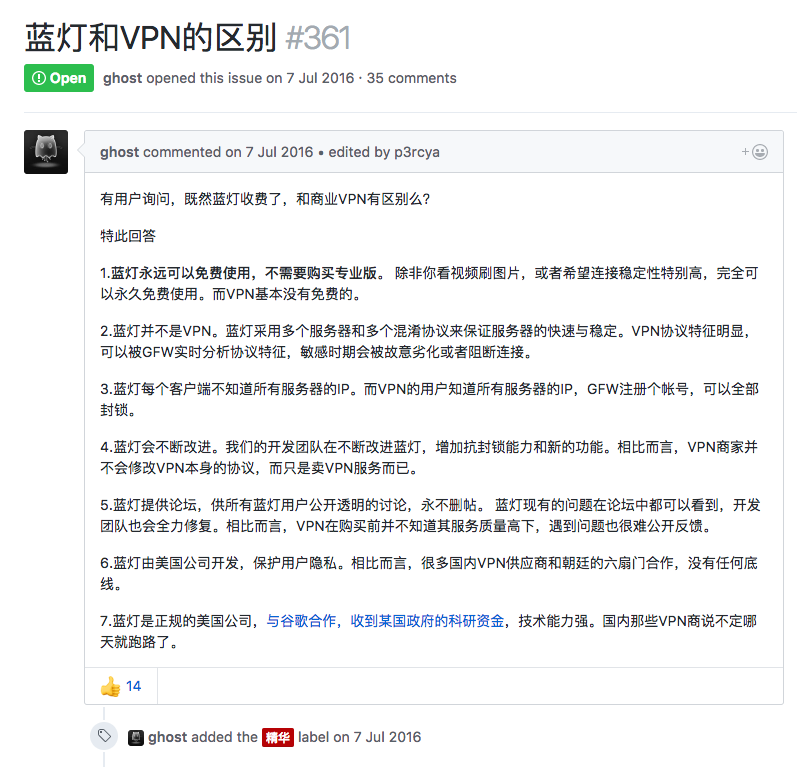

# 问题

1. 代理服务器的机制是什么？CONNECT 方法是必须的吗？VPN 是怎么回事？Lantern 是什么情况？和 SSR 之类的有什么区别？

   >

2. GFW 使用的技术和大致原理

3. IP的问题，据说IP资源十分紧缺，那阿里云和那些商业云服务公司提供的服务器都有自己的IP吗？如果一台物理服务器上有多台虚拟服务器，在直接用IP访问时会发生什么？

4. 代理，网关，隧道更深层次的原理。比如代理服务器和普通服务器在网络中担任地位有何不同？HTTPS必须用隧道吗？隧道又如何实现？

5. IP 协议的 路由选择如何实现？

6. 证书机构的数字签名如何实现？

7. CBC 模式

8. ​

