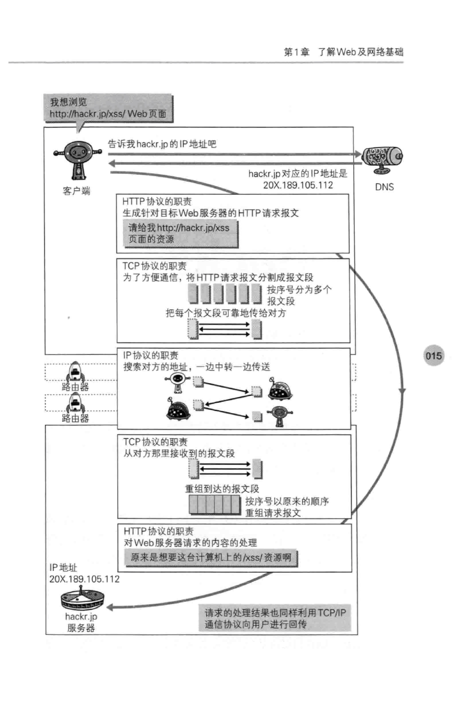

# TCP/IP 分层

## 分层

+ 应用层

  > 该层决定了向用户提供应用服务时的通信服务，
  >
  > HTTP协议, FTP,  DNS服务都在这层

+ 传输层

  > 提供网络连接中两台计算机之间的数据传输，
  >
  > TCP, UDP 在这层

+ 网络层

  > 用来处理在网络上流动的数据包，
  >
  > 规定了由怎样的路径到达对方计算机，
  >
  > IP协议在这层

+ 链路层

  > 用来处理连接网络的硬件部分

## 部分协议和服务

### IP协议

负责传输，通过IP地址进行中转，利用**ARP协议 (Address Resolution Protocol)** 使用下一站的 IP地址 查询 与之对应的 MAC地址，**凭借这个 MAC 地址 搜索下一个中转目标**，在到达通信目标的中转过程中，计算机和路由器等网络设备只能获得很粗略的路线，IP协议使用的选择机制被称作**路由选择 (Routing)**

### TCP协议

确保可靠性，为了方便传输，TCP 会把大数据块分割成报文段，另外还会通过 “三次握手” 来确认数据到达目标

> **“三次握手”**
>
> 1. -发送端发送带 **SYN (synchronize)** 标志的数据包
> 2. 接收端接收到后回传带 **SYN/ACK** 标志的数据包
> 3. 发送端发送带 **ACK (acknowledgement)** 标志的数据包，代表“握手“结束

### DNS服务

通过 域名 查找 IP地址，或者通过 IP地址 反查 域名

## 大致流程
